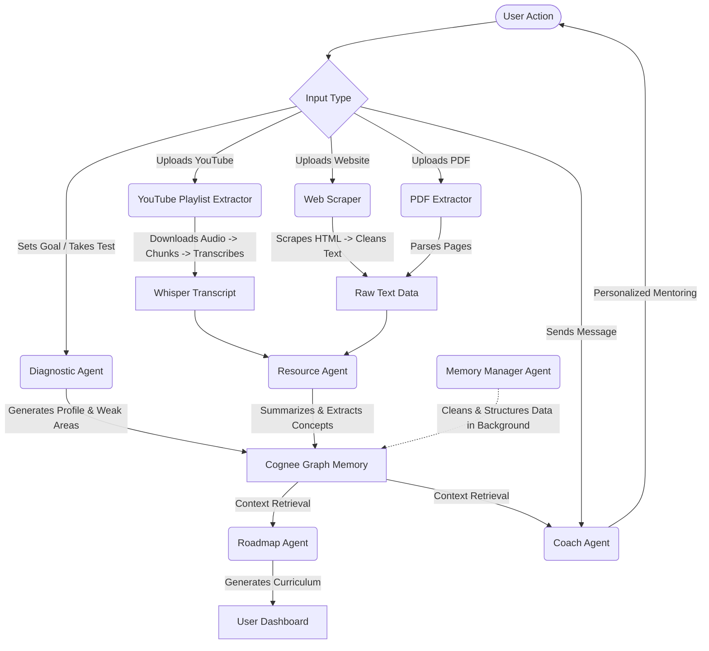

# End-to-End Platform Workflow

This document outlines the complete lifecycle of a user's interaction with the platform, detailing exactly how the different services, scrapers, agents, and the Cognee memory system work together in a unified pipeline.

## 🔄 High-Level Data Flow

---

## 📖 Step-by-Step Walkthrough

### 1. The Onboarding & Diagnostics Flow
1. **User Action:** The user inputs a learning goal (e.g., "AI Engineer").
2. **Diagnostic Agent:** Triggered to generate a dynamic multiple-choice test based on the goal.
3. **Scoring:** The user submits their answers. The Diagnostic Agent grades the test, identifying specific weak areas and existing knowledge.
4. **Memory Injection:** These insights (weak areas, goals, format preferences) are formatted by the **Memory Manager Agent** (a fast 8B model) and permanently stored in the **Cognee Knowledge Graph**.

### 2. The Roadmap Generation Flow
1. **Trigger:** The user clicks "Generate Final Roadmap".
2. **Context Retrieval:** The system queries Cognee to fetch the user's *entire* profile (goal, weak areas, diagnostic score).
3. **Roadmap Agent:** This massive context payload is sent to the heavy-duty **Qwen 3.7 Plus** model.
4. **Output:** The agent performs deep reasoning to construct a multi-week JSON syllabus, prioritizing the user's weak areas and preferred learning formats.

### 3. The Resource Extraction Flow (Web & YouTube)
When a user wants to add custom learning materials to their roadmap, they paste a link.

#### Path A: YouTube Playlist Extractor
1. **Playlist Parsing Optimization:** When a user submits a massive playlist (e.g., 100+ videos), traditional scrapers would make 100+ separate API calls to fetch the title, ID, and duration of each video, severely risking rate-limiting. Instead, the **YouTube Playlist Extractor** uses `yt-dlp` with the `extract_flat=True` parameter. This fetches the entire playlist's metadata in a single flat batch, reducing what used to be ~110 API calls down to roughly 12 calls!
2. **Audio Extraction:** Once a specific video from that parsed playlist is selected for processing, it downloads the absolute lowest-quality audio stream to save bandwidth.
3. **Smart Chunking:** If the audio is over 45 minutes, `pydub` intelligently slices it into smaller chunks to bypass the Whisper API's 25MB file size limit.
4. **Transcription:** The audio chunks are sent to the Whisper API, and the text transcripts are stitched back together for the agent.

#### Path B: Web Scraping
1. **HTML Parsing:** The **Web Service** uses `BeautifulSoup` to fetch the website.
2. **Sanitization:** It aggressively strips out navbars, footers, ads, and scripts, leaving only the core educational article text.

#### Resource Summarization
Regardless of whether the text came from a Web Scraper or a Video Transcript, it is sent to the **Resource Agent** (running on a fast Cloudflare model). The agent generates a structured summary of the material.

### 4. The Cognee Graph Integration Flow
1. **Cognify:** The structured summary from the Resource Agent is passed into **Cognee**.
2. **Graph Extraction:** Cognee uses a Cerebras LLM to chunk the summary and extract semantic Nodes (e.g., "Machine Learning", "Gradient Descent") and Edges (e.g., "Machine Learning *requires* Gradient Descent").
3. **Storage:** This interconnected web of concepts is saved locally.

### 5. The AI Coaching Flow
1. **User Action:** The user sends a chat message: *"I don't understand the video I just watched about Gradient Descent."*
2. **Graph Retrieval:** The backend asks Cognee to search the Knowledge Graph for "Gradient Descent" AND "User Weak Areas". 
3. **Context Assembly:** Cognee returns the summary of the YouTube video, the user's prior diagnostic scores, and their current week in the roadmap.
4. **Coach Agent:** This massive context is injected into the **Gemma 31B** prompt.
5. **Personalized Response:** Because the Coach has the entire graph context, it replies: *"Since you struggled with calculus in the diagnostic test, let's break down Gradient Descent without the math..."*
6. **Memory Loop:** The conversation itself is summarized by the **Memory Manager** and stored back into Cognee, ensuring the Coach remembers this interaction forever.
